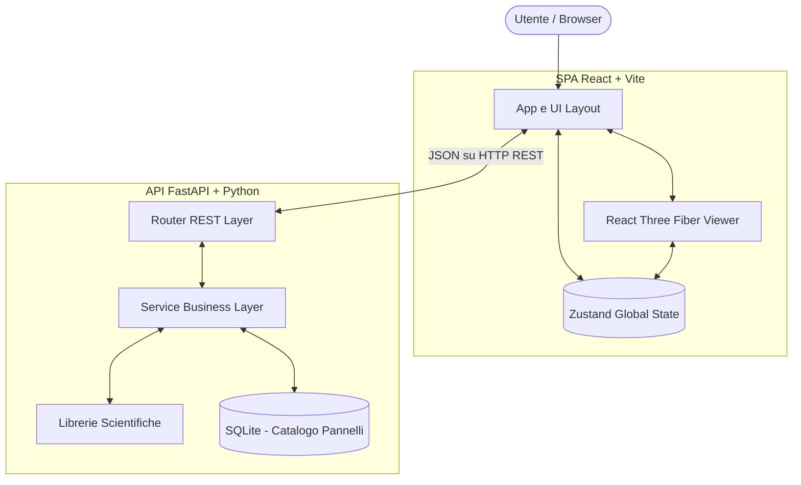
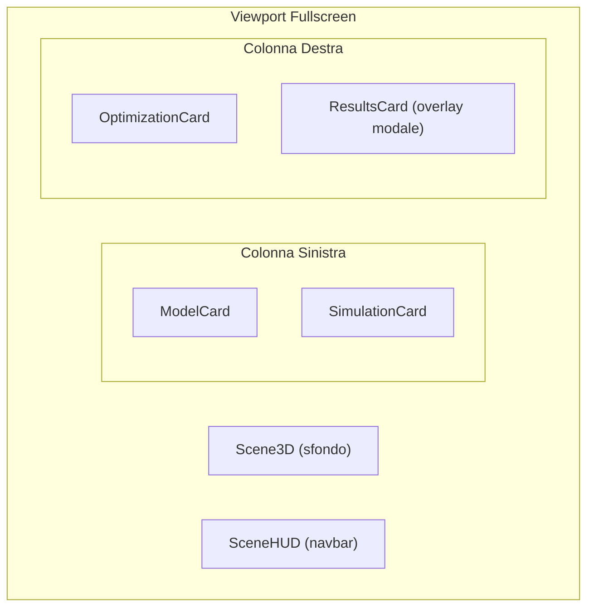
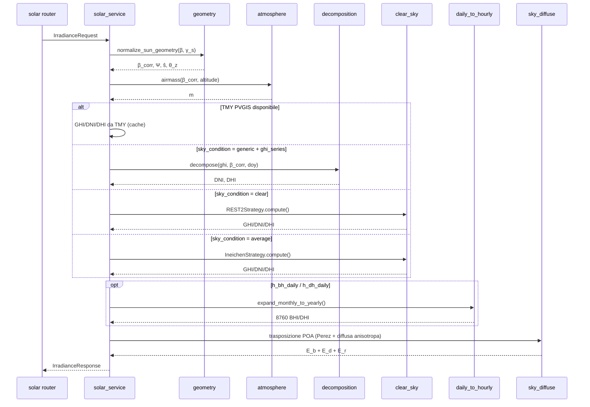
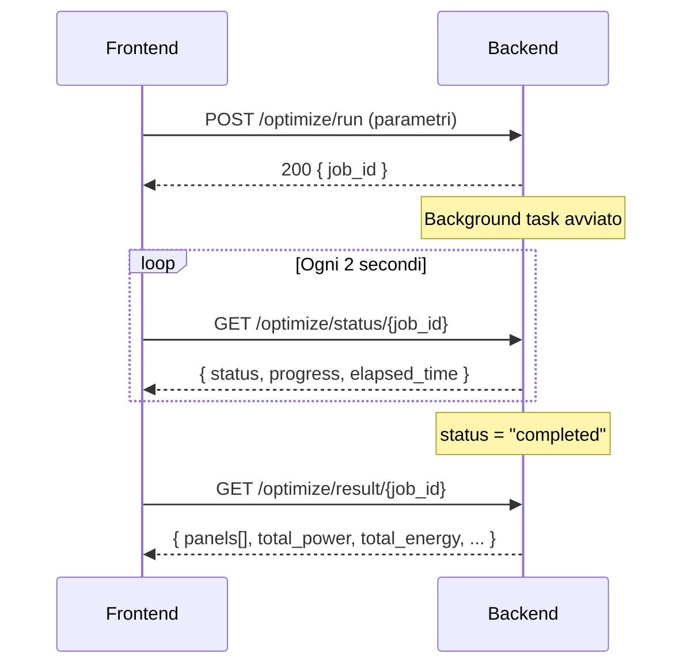

# Architettura Software di SolarOptimizer3D

L'architettura di SolarOptimizer3D si basa su un pattern architetturale multi-layer, separando le responsabilità tra Cliente Web interattivo (Frontend) e API Server ad alta intensità di calcolo (Backend).

## 1. Diagramma Generale dei Componenti



---

## 2. Frontend (Client-side)

Il frontend e un'applicazione Single Page (SPA) costruita con **React 18** e **Vite**. La sua funzione principale e la visualizzazione 3D interattiva, la configurazione dei parametri di progetto e la consultazione dei risultati.

### Struttura e Librerie Principali

- **Rendering 3D:** `@react-three/fiber` (wrapper React per Three.js) e `@react-three/drei`. Gestisce la visualizzazione dell'edificio (parametrico o importato via mesh), l'orientamento solare, le heatmap delle ombre e gli oggetti ostacolo (camini, antenne, alberi).
- **State Management:** `zustand`. Un singolo store in `frontend/src/store/useStore.js` suddiviso in domini logici:
  - `ui`: Gestione dei tab (`model` | `simulation` | `optimization` | `results`), card attive, modalita di misura.
  - `project`: Latitudine, longitudine, tilt, azimut, timezone.
  - `building`: Dimensioni parametriche, tipo tetto, ostacoli, mesh importata, rotazione modello, facce cancellate, zone di installazione.
  - `solar`: Sun path, irradianza, shadow grid, modalita di analisi (annuale/mensile/istantanea).
  - `dailySimulation`: Dati simulazione giornaliera, controlli playback.
  - `panels`: Catalogo pannelli (datasheet), selezione multipla, confronto, risultati multi-pannello.
  - `optimization`: Pannelli manuali, specifiche pannello, vincoli, job asincrono, risultato.
- **Grafici:** `recharts` per i cruscotti di produzione energetica e reportistica.
- **Icone:** `lucide-react` per il set di icone coerente.
- **Styling:** CSS custom con design tokens in `frontend/src/styles/tokens.css` — palette scura con effetto glassmorphism.
- **API Client:** Layer incapsulato in `utils/api.js` basato su `fetch` API nativa per la comunicazione con il Backend.

### Layout UI

L'interfaccia e costruita con un pattern **scena 3D a schermo intero** con **card flottanti sovrapposte**:



Le card utilizzano il componente `FlashCard.jsx` con:

- Header compatto (48px) sempre visibile
- Body espandibile con animazione (`max-height`, `opacity`)
- Accento colorato per dominio: blu (modello), arancione (simulazione), teal (ottimizzazione), viola (risultati)
- Effetto glassmorphism: `backdrop-filter: blur(20px)`

### Flusso Dati Architetturale

1. L'utente innesca un'azione dallo strato UI (es. "Calcola Ombre", `fetchShadows()`).
2. Lo store Zustand passa in modalita `isLoading: true` e registra il `startTime` per il timer.
3. Il layer API (`utils/api.js`) invia la richiesta HTTP al backend via `fetch`.
4. Al risolversi della Promise, `isLoading: false` e i campi corrispondenti vengono aggiornati.
5. I layer di visualizzazione (Recharts, React Three Fiber) si aggiornano reattivamente.

---

## 3. Backend (Server-side)

Il server applicativo, scritto in **Python 3.11** tramite **FastAPI**, riceve JSON serializzati e converte calcoli scientifici in output leggeri visualizzabili dal Web. Segue la struttura **Model-Service-Router**.

### Layered Architecture

#### A. API Endpoints / Router Layer (`backend/app/api/`)

Livello di interfaccia esterno. Definizione delle route REST, documentate in Swagger UI (`/docs`). Raccoglie i payload HTTP e demanda ai Service la logica complessa.

8 router registrati in `main.py`:

- `/api/v1/solar` — Posizione solare, irradianza, ombre, simulazione giornaliera, analisi economica
- `/api/v1/building` — Upload e processamento mesh 3D
- `/api/v1/optimize` — Esecuzione ottimizzazione Seed-and-Grow (asincrona con polling)
- `/api/v1/annual-surface` — Superficie annuale di potenza 3D (asincrona con polling)
- `/api/v1/panels` — CRUD catalogo pannelli + confronto
- `/api/v1/inverters` — CRUD catalogo inverter
- `/api/v1/stringing` — Dimensionamento stringhe (auto/manuale)
- `/api/v1/export` — Generazione PDF e CSV (riepilogativo + orario)

#### B. Data Models (`backend/app/models/`)

Strato di validazione forte usando oggetti **Pydantic v2**. Assicura che il JSON scambiato contenga i tipi di dato previsti, con type-casting automatico. Moduli:

- `solar.py` — SunPathRequest/Response, IrradianceRequest/Response, DailySimulationRequest/Response, HourlyDataPoint
- `shadow.py` — ShadowRequest/Response
- `optimization.py` — OptimizationRequest, PanelSpecs, OptimizationConstraints, BuildingGeometry, PanelPosition, OptimizationResult, OptimizationStatus
- `panel.py` — PanelCreate, PanelRead, PanelComparisonRequest/Response, PanelProductionEstimate

#### C. Business Services (`backend/app/services/`)

Il "cervello" del sistema. Il dominio solare/ombre è suddiviso in moduli specializzati che alimentano i due service di alto livello (`solar_service` e `shadow_service`):

**Moduli del motore solare/atmosferico:**

- **`geometry.py`** — Normalizzazione della posizione solare pvlib alla convenzione del riferimento (§1.2.1, Eq. 1.13–1.14): correzione rifrattiva di Saemundsson/Bennett, doppio azimut ($\gamma_s$ pvlib + $\Psi$ riferimento), versore solare $\hat{s}$ in coordinate Y-up.
- **`atmosphere.py`** — Massa d'aria di Kasten-Young (Eq. 1.27) con correzione altitudinale tramite scala barometrica isoterma 8434.5 m (Eq. 1.28). Profili aerosol predefiniti (rural/urban/industrial) e derivazione torbidezza di Linke da coefficienti di Ångström.
- **`clear_sky.py`** — Modelli clear-sky con strategy pattern: `IneichenStrategy` (Ineichen-Perez 2002, default) e `REST2Strategy` (Bird/REST2, attivo con `sky_condition='clear'`).
- **`decomposition.py`** — Decomposizione GHI → (DNI, DHI) con tre modelli intercambiabili: Erbs (1982), Skartveit-Olseth (1987), Ruiz-Arias (2010, sigmoidale).
- **`daily_to_hourly.py`** — Disaggregazione di profili sintetici da UNI 10349-3 (12 valori mensili medi giornalieri) in 8760 ore: Collares-Pereira & Rabl (1979) per la beam, Liu & Jordan (1960) per la diffuse, espansione tramite giorno rappresentativo di Klein (1977).
- **`sky_diffuse.py`** — Modello di radianza diffusa anisotropo TCCD di Brunger-Hooper (Eq. 4.45). Griglia di patch celeste/terrestre (5°×10° → 648 patch per emisfero), calcolo SVF anisotropo $F_{s,d}$ e fattori di ostruzione $F_{s,th}$/$F_{s,rh}$ (Eq. 4.2).
- **`vegetation.py`** — Trasmissività mensile della chioma (Tab. 6.2 riferimento, §6.8.3). Mapping forme UI → famiglie canoniche (troncoconica, ellissoidale), curve stagionali deciduous/evergreen, override custom 12 valori.

**Service di alto livello:**

- **`solar_service.py`** — Posizioni solari annuali (filtrate per $\beta_{\mathrm{corr}} > 0$), pipeline irradianza POA (TMY PVGIS con cache → eventuale decomposizione → trasposizione anisotropa Perez/Hay-Davies), simulazione giornaliera con modello termico NOCT, analisi economica (autoconsumo + payback).
- **`shadow_service.py`** — Costruisce scene 3D con `trimesh`. Composizione di tre contributi: ray-casting diretto (con $\hat{s}$ corretto Bennett), riduzione SVF/anisotropa sulla diffusa (`sky_diffuse`), attenuazione vegetazione (`vegetation`). Aggregazione energy-weighted (Eq. 4.46) e media temporale.
- **`optimization_service.py`** — Algoritmo **Seed-and-Grow** greedy spaziale: espansione BFS con coda a priorità, vicini Von Neumann, doppio run Portrait/Landscape con selezione automatica orientamento.
- **`annual_surface_service.py`** — Superficie 3D di potenza integrata sull'anno, async polling.
- **`stringing_service.py`** — Dimensionamento stringhe serie/parallelo con verifica MPPT, Voc/Isc a temperatura, rapporto DC/AC.
- **`thermal.py`** — Modello termico NOCT.
- **`building_service.py`** — Processamento mesh 3D, conversione assi Z-up → Y-up.
- **`export_service.py`** — Generazione report PDF (ReportLab) e CSV.

**Flusso di calcolo irradianza:**



#### D. Persistenza (`backend/app/db.py`)

Database **SQLite** (stdlib `sqlite3`, nessun ORM) per il catalogo pannelli fotovoltaici:

- Tabella `panels` con 12 campi: id, costruttore, modello, potenza, efficienza, dimensioni, peso, temperatura operativa, coefficiente termico, garanzia, degrado
- Inizializzato automaticamente al startup via `lifespan` hook in `main.py`
- Row factory abilitata per accesso per nome colonna

### Comunicazione Asincrona (Job Polling)

I calcoli brevi (sun path, irradianza, ombre) sono serviti in modo sincrono. L'ottimizzazione Seed-and-Grow segue il pattern **Job-Polling**:



I job sono memorizzati in un dizionario in memoria (`_jobs` dict). Il frontend gestisce il polling con `setInterval` e aggiorna lo store con progresso, tempo trascorso e tempo stimato rimanente.

---

## 4. Sistemi di Coordinate

SolarOptimizer3D gestisce la conversione tra 3 sistemi di riferimento:

1. **Lat/Long (Geospaziale):** Utilizzato per l'input utente e le API pvlib/PVGIS.
2. **Y-Up (Three.js / Frontend / Ray-casting):** Coordinate 3D in metri. Asse X = Est/Ovest, Y = Alto, Z = Nord/Sud (invertito: $-Z$ = Nord). Tutti i calcoli 3D e il rendering avvengono in questo sistema.
3. **Z-Up (Formato Mesh Input):** I file OBJ/STL usano tipicamente Z come asse verticale. Il servizio di importazione applica una rotazione di $-90°$ attorno a X per convertire in Y-Up.

La **rotazione dell'edificio** collega il sistema geospaziale a quello 3D:

$$\theta_{rot} = -(\gamma_{azimut} + \theta_{modello}) \cdot \frac{\pi}{180}$$

Il backend applica la stessa rotazione inversa ai vettori solari durante il ray-casting, garantendo coerenza tra frontend e calcoli.

---

## 5. Stack Tecnologico

### Frontend

| Tecnologia | Versione | Ruolo |
| --- | --- | --- |
| React | 18 | Framework UI |
| Vite | 5 | Build tool e dev server con HMR |
| Three.js | - | Engine 3D |
| @react-three/fiber | - | Binding React per Three.js |
| @react-three/drei | - | Helper components per R3F |
| Zustand | - | State management |
| Recharts | - | Grafici e visualizzazione dati |
| Lucide React | - | Icone |

### Backend

| Tecnologia | Versione | Ruolo |
| --- | --- | --- |
| Python | 3.11 | Runtime |
| FastAPI | - | Framework web asincrono |
| pvlib | - | Calcoli fotovoltaici |
| trimesh | - | Processamento mesh 3D e ray-casting |
| ReportLab | - | Generazione PDF |
| SQLite | stdlib | Persistenza catalogo pannelli |

### Infrastruttura

| Tecnologia | Ruolo |
| --- | --- |
| Docker Compose | Orchestrazione container |
| Uvicorn | ASGI server per FastAPI |

---

## 6. Struttura Directory

```text
solar-optimizer/
├── frontend/
│   ├── src/
│   │   ├── components/
│   │   │   ├── 3d/              # Scene3D, Building, SolarPanel, ShadowHeatmap,
│   │   │   │                    # OptimizedPanels, Obstacle, SunPath, PanelPlacer,
│   │   │   │                    # InstallationZone, MeasureTool, CompassRose
│   │   │   ├── cards/           # FlashCard, ModelCard, SimulationCard,
│   │   │   │                    # OptimizationCard, ResultsCard, ObstaclesCard
│   │   │   ├── layout/          # MainContent, SceneHUD, ComputationTimer
│   │   │   ├── dashboard/       # MonthlyChart, DailyProfileChart, ShadowLegend,
│   │   │   │                    # EnergyMetrics, LossBreakdown, ExportButtons
│   │   │   └── optimization/    # PanelManualForm, PanelComparisonChart,
│   │   │                        # OptimizationProgress, PanelControls
│   │   ├── store/
│   │   │   └── useStore.js      # Zustand store globale (6 slice)
│   │   ├── utils/
│   │   │   ├── api.js           # Fetch API client
│   │   │   ├── coordinates.js   # Conversione coordinate solari
│   │   │   ├── roofGeometry.js  # Geometria tetti (flat, gable, hip)
│   │   │   └── obstacleDefaults.js  # Default ostacoli e trasmissivita
│   │   └── styles/
│   │       └── tokens.css       # Design tokens (palette, glass, bordi)
│   ├── Dockerfile
│   └── package.json
├── backend/
│   ├── app/
│   │   ├── main.py              # FastAPI app, CORS, lifespan, router
│   │   ├── db.py                # SQLite persistence
│   │   ├── api/                 # Route handlers (5 router)
│   │   ├── models/              # Pydantic request/response
│   │   ├── services/            # Business logic (5 servizi)
│   │   └── core/
│   │       └── config.py        # Settings (env vars)
│   ├── tests/                   # pytest + pytest-asyncio
│   ├── data/                    # panels.db (SQLite)
│   ├── Dockerfile
│   └── requirements.txt
├── docs/                        # Documentazione completa
├── docker-compose.yml
├── CLAUDE.md                    # Istruzioni per AI coding
└── README.md
```
