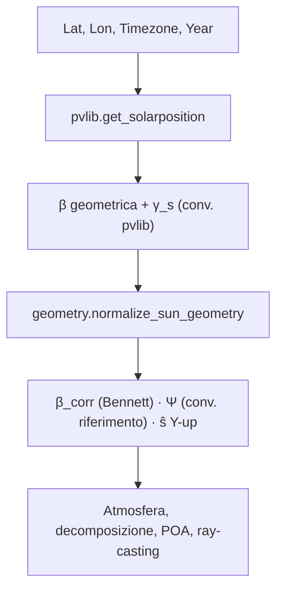
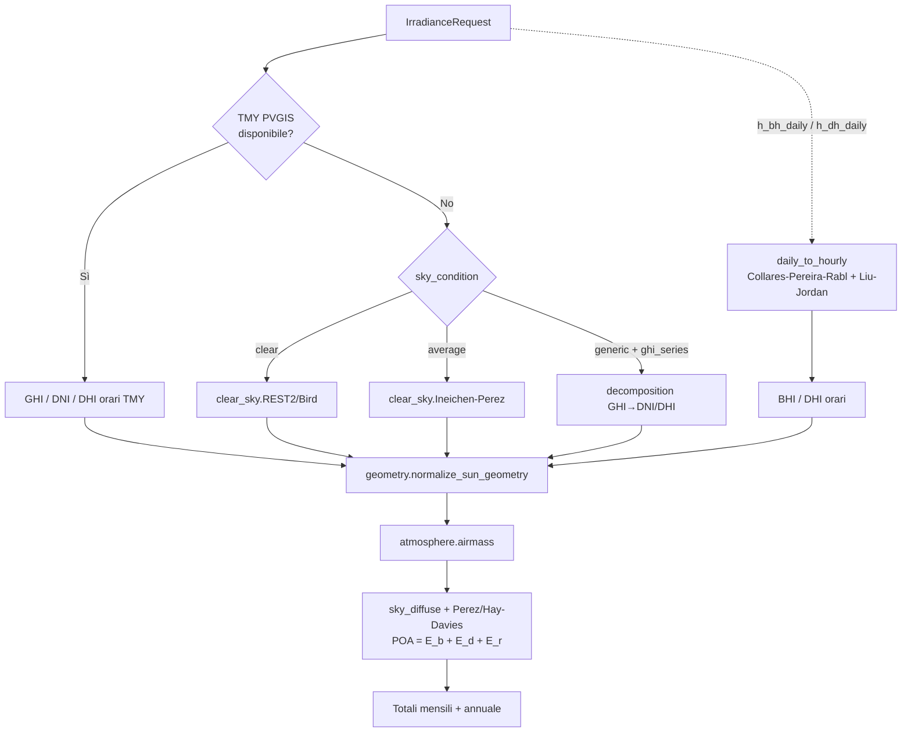
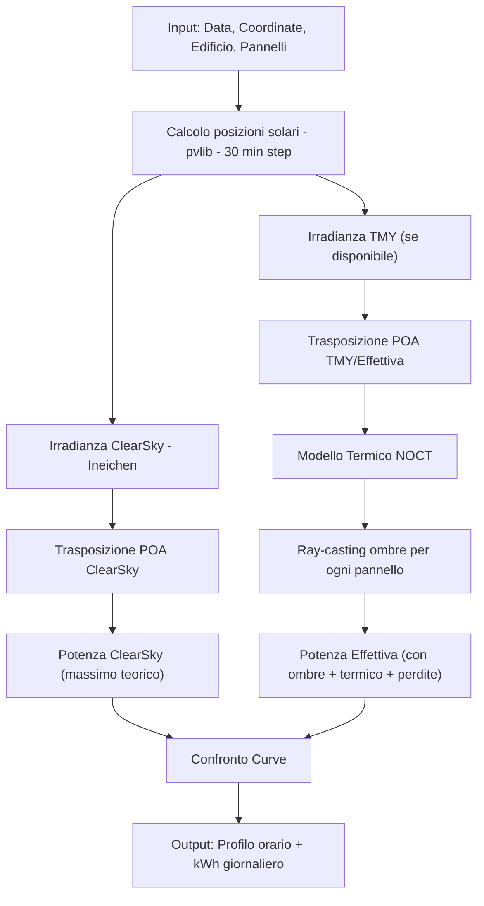
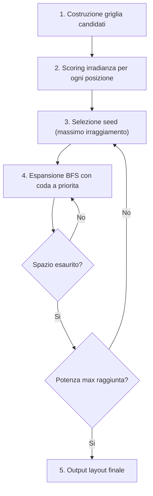

# Modelli Fisici e Matematici (SolarOptimizer3D)

Questo documento descrive in dettaglio i modelli fisici e matematici implementati in SolarOptimizer3D per il calcolo della posizione solare, dell'irradianza, dell'ombreggiamento, del modello termico, dell'ottimizzazione del posizionamento, del dimensionamento stringhe e dell'analisi economica.

---

## 1. Posizione Solare

Il sistema utilizza la libreria `pvlib` per il calcolo astronometrico delle effemeridi solari, e applica un livello di **normalizzazione geometrica** in `app/services/geometry.py` che riallinea le grandezze alla convenzione del riferimento fisico (`docs/Riferimento.md`, §1.2.1, Eq. 1.13–1.14) e produce direttamente il versore solare in coordinate di scena Y-up.

### 1.1 Coordinate Orizzontali

Per ogni timestamp della simulazione, `pvlib.location.get_solarposition` calcola:

- **Declinazione solare ($\delta$)** e **angolo orario ($\omega$)** dalla data e dalla longitudine.
- **Elevazione geometrica ($\beta$)** sopra l'orizzonte, prima della rifrazione.
- **Azimut ($\gamma_s$)** in convenzione pvlib: $0° = $ Nord, $90° = $ Est, $180° = $ Sud, $270° = $ Ovest.

### 1.2 Correzione Rifrattiva (Saemundsson/Bennett)

L'elevazione vera $\beta$ viene corretta per la rifrazione atmosferica con la formula di Bennett (Eq. 1.13–1.14 del riferimento), in arcominuti:

$$ \Delta\beta = \frac{1}{\tan\!\left(\beta + \dfrac{7.31}{\beta + 4.4}\right)} \quad [\text{arcmin}] $$

$$ \beta_{\mathrm{corr}} = \beta + \frac{\Delta\beta}{60} $$

Per $\beta < -0.575°$ (sole sotto orizzonte, divergenza della formula) si usa l'espansione asintotica $\Delta\beta = -20.774 / \tan(\beta)$. L'elevazione corretta $\beta_{\mathrm{corr}}$ è la grandezza alimentata a tutti gli step downstream (massa d'aria, decomposizione, trasposizione POA, ray-casting).

### 1.3 Doppia Convenzione di Azimut

Il modulo `geometry.py` espone in parallelo:

- **Convenzione pvlib** ($\gamma_s$, 0° = Nord), usata da tutti gli ingressi `pvlib`.
- **Convenzione del riferimento** ($\Psi = \gamma_s - 180°$, 0° = Sud, $-$ a Est, $+$ a Ovest), usata nelle equazioni di trasposizione del riferimento.

### 1.4 Versore Solare in Scena Y-up

Il versore $\hat{s}$ è calcolato direttamente in coordinate di scena Three.js ($-Z = $ Nord, $+X = $ Est, $+Y = $ alto):

$$ \hat{s}_x = \cos\beta_{\mathrm{corr}} \cdot \sin\gamma_s, \quad
   \hat{s}_y = \sin\beta_{\mathrm{corr}}, \quad
   \hat{s}_z = -\cos\beta_{\mathrm{corr}} \cdot \cos\gamma_s $$

Il namedtuple `SunGeometry` restituito da `normalize_sun_geometry()` raccoglie $\beta$, $\beta_{\mathrm{corr}}$, $\Psi$, lo zenith apparente $\theta_z = 90° - \beta_{\mathrm{corr}}$ e $\hat{s}$.

Dalla generazione temporale (passo orario su un anno) vengono escluse le ore con $\beta_{\mathrm{corr}} \leq 0$.

---

## 2. Atmosfera e Massa d'Aria

Lo step di pre-processing atmosferico è isolato in `app/services/atmosphere.py` e quantifica la lunghezza relativa del cammino ottico attraverso l'atmosfera, parametro chiave per i modelli clear-sky e di scomposizione.

### 2.1 Massa d'Aria Kasten-Young

L'implementazione segue la relazione di Kasten-Young (1989), Eq. 1.27 del riferimento, in funzione dell'elevazione corretta $\beta_{\mathrm{corr}}$ in gradi:

$$ m_0 = \frac{1}{\sin\beta_{\mathrm{corr}} + 0.50572 \cdot (\beta_{\mathrm{corr}} + 6.07995)^{-1.6364}} $$

Per $\beta_{\mathrm{corr}} < 0$ la funzione restituisce $+\infty$ (sole sotto orizzonte).

### 2.2 Correzione Altitudinale

La pressione decresce esponenzialmente con la quota secondo l'atmosfera isoterma standard ($T = 288.15\ K$, scala $H = R_\text{air} T / g \approx 8434.5\ m$). Eq. 1.28 del riferimento:

$$ \frac{p}{p_0} = \exp\!\left(-\frac{z}{8434.5}\right), \qquad m = m_0 \cdot \frac{p}{p_0} $$

dove $z$ è l'altitudine del sito in metri s.l.m. (campo `altitude` nei modelli `SunPathRequest`, `IrradianceRequest`, `DailySimulationRequest`).

### 2.3 Profili di Torbidezza Aerosol

Il modulo definisce 3 profili predefiniti (Tab. 1.1 del riferimento) attraverso i coefficienti di Ångström $(\beta_A, \alpha)$:

| Profilo | $\beta_A$ | $\alpha$ | Uso tipico |
|---------|-----------|----------|------------|
| `rural`      | 0.05 | 1.3 | Campagna, aria pulita |
| `urban`      | 0.10 | 1.3 | Città di medie dimensioni |
| `industrial` | 0.20 | 1.3 | Aree industriali, aerosol pesanti |
| `custom`     | utente | utente | Override manuale |

La torbidezza di Linke $T_L$ è derivabile dai coefficienti di Ångström tramite `linke_turbidity_from_angstrom`:

$$ \tau_a = \beta_A \cdot 0.5^{-\alpha}, \qquad \tau_R = \frac{1}{9.4 + 0.9\, m}, \qquad T_L = 1 + \frac{\tau_a + \tau_{w,o}}{\tau_R} $$

con $\tau_{w,o} \approx \tau_R$ (contributo standard di vapore acqueo + ozono che garantisce $T_L \approx 2$ per atmosfera pulita).

---

## 3. Irradianza

Il calcolo dell'irradianza determina l'energia incidente su un pannello inclinato (Plane of Array, POA) attraverso una pipeline composta da: acquisizione dati orizzontali → eventuale scomposizione GHI → trasposizione anisotropa → totali mensili e annuali.

### 3.1 Dati Meteorologici (TMY)

Il sistema tenta prima di scaricare dati **TMY (Typical Meteorological Year)** dall'API PVGIS per la località selezionata, contenenti GHI, DNI, DHI, temperatura ambiente e velocità del vento. I dati sono memorizzati in **cache in memoria** (coordinate arrotondate a 1 decimale) per ridurre le chiamate API. Se TMY non è disponibile, il sistema procede col modello clear-sky in fallback (`app/services/clear_sky.py`).

### 3.2 Modelli Clear-Sky

`clear_sky.py` espone due strategie selezionabili tramite il campo `sky_condition`:

- **`average`/`generic` → `IneichenStrategy`**: Ineichen-Perez (2002) via `pvlib`, con $T_L$ climatologica o quella derivata dai coefficienti di Ångström.
- **`clear` → `REST2Strategy`**: approssimazione REST2 / Bird via `pvlib.clearsky.bird`, con AOD a 380 nm e 500 nm derivati dalla legge di Ångström $\tau_a(\lambda) = \beta_A \cdot \lambda^{-\alpha}$, acqua precipitabile 1.5 cm e ozono 0.3 atm-cm. Restituisce DNI sistematicamente più elevato di Ineichen per cielo realmente sereno.

Entrambe le strategie ritornano $\{GHI, DNI, DHI\}$ orari clip $\geq 0$.

### 3.3 Decomposizione GHI → (DNI, DHI)

Quando è disponibile solo la GHI (serie misurata in `ghi_series` con `sky_condition='generic'`), `app/services/decomposition.py` ricostruisce le componenti diretta e diffusa. L'indice di clearness è:

$$ K_t = \frac{GHI}{I_0 \cdot \cos\theta_z}, \qquad I_0 = \text{irradianza extraterrestre} $$

Tre modelli intercambiabili (selettore `decomposition_model`):

- **`erbs`** — Erbs et al. (1982), piecewise: $K_t \leq 0.22$, $0.22 < K_t \leq 0.80$, $K_t > 0.80$. Implementazione via `pvlib.irradiance.erbs`.
- **`skartveit_olseth`** — Skartveit & Olseth (1987) con breakpoint 0.30 e 0.78, polinomio centrale ampliato.
- **`ruiz_arias`** — Ruiz-Arias et al. (2010) sigmoidale, $k_d = [1 + \exp(-5.0033 + 8.6025\,K_t - 0.00632\,m)]^{-1}$, con correzione opzionale per massa d'aria assoluta.

In tutti i casi: $DHI = k_d \cdot GHI$, $DNI = (GHI - DHI)/\cos\theta_z$.

### 3.4 Disaggregazione Daily → Hourly

Per profili sintetici da tabelle UNI 10349-3 (12 valori mensili medi giornalieri di $H_{bh}$ e $H_{dh}$ in kWh/m²·d), `app/services/daily_to_hourly.py` espande in 8760 valori orari combinando:

- **Beam**: Collares-Pereira & Rabl (1979) — coefficiente $r_t(\omega, \omega_s)$ con $a, b$ funzione dell'angolo orario al tramonto $\omega_s$.
- **Diffuse**: Liu & Jordan (1960) — coefficiente $r_d(\omega, \omega_s) = (\pi/24)(\cos\omega - \cos\omega_s)/(\sin\omega_s - \omega_s\cos\omega_s)$.

L'espansione mensile usa il giorno rappresentativo di Klein (1977) per ogni mese (DOY 17, 47, 75, …) e replica il pattern orario tramite `np.tile`. Conservazione: $\sum_h H_{\text{hourly}} \cdot 1\,h \approx H_{\text{day}} \cdot 1000\ \text{Wh/m}^2$.

### 3.5 Trasposizione su Piano Inclinato (POA)

Il sistema utilizza il **modello anisotropo di Perez** (via `pvlib.irradiance.get_total_irradiance`) per la trasposizione su piano inclinato. La diffusa anisotropa è inoltre disponibile come modello **Brunger-Hooper TCCD** in `app/services/sky_diffuse.py`, attivabile dal motore ombre (vedi §4) e che cattura le tre componenti circumsolare, brightening all'orizzonte e fondo isotropo:

$$ R(\theta_p, \Theta) = a_0 + a_1 \sin\theta_p + a_2 \exp(-a_3 \Theta) $$

con $a_0 = 1/\pi$, $a_1 = 0.6(1-K_d)$, $a_2 = 4.0(1-K_d)$, $a_3 = 8.0$. $\Theta$ è la distanza angolare patch–sole.

L'irradianza globale POA è la somma:
$$ E_{poa} = E_{b,poa} + E_{d,poa} + E_{r,poa} $$

dove $E_{b,poa} = DNI \cdot \cos\theta_{\text{inc}}$, $E_{d,poa}$ è la diffusa dal cielo (Perez o Brunger-Hooper, modulata da SVF e horizon brightening) e $E_{r,poa} = GHI \cdot \rho \cdot (1 - \cos\beta)/2$ con albedo $\rho \approx 0.2$.

I risultati sono aggregati in **totali mensili** e **totale annuale** in $\text{kWh/m}^2$. Quando `roof_surfaces` è fornito, il calcolo è eseguito per ogni falda con i pesi forniti e restituito anche per superficie (`per_surface`).

---

## 4. Ombreggiamento (Ray-casting)

Il motore delle ombre, in `app/services/shadow_service.py`, calcola una heatmap sul tetto dell'edificio combinando tre contributi fisici distinti:

1. **Diretta** — ray-casting geometrico verso $\hat{s}$ (corretto Bennett, vedi §1).
2. **Diffusa** — frazione di volta celeste visibile (Sky View Factor classico oppure modello anisotropo Brunger-Hooper TCCD con horizon brightening, `sky_diffuse.compute_diffuse_shading_factor`).
3. **Vegetazione** — attenuazione mensile della chioma con tabella stagionale di trasmissività (`vegetation.resolve_monthly_transmissivity`).

### 4.1 Vettori Solari

Il sole viene modellato come una serie di vettori direttori $\hat{s}$ verso la sua posizione apparente, calcolati nel sistema di coordinate Y-up (Three.js standard):
$$ \hat{s}_x = \cos(\alpha) \cdot \sin(\gamma_s) $$
$$ \hat{s}_y = \sin(\alpha) $$
$$ \hat{s}_z = -\cos(\alpha) \cdot \cos(\gamma_s) $$

Dove $-Z$ = Nord ($\gamma_s = 0°$) e $+X$ = Est ($\gamma_s = 90°$).

#### Modalita di Campionamento

I vettori solari vengono generati in base alla modalita di analisi:

| Modalita | Campionamento | Vettori (~) |
|----------|---------------|-------------|
| **Annuale** | 12 giorni rappresentativi (15 di ogni mese), ore 8-18 | ~132 |
| **Mensile** | Tutti i giorni del mese selezionato, ore 8-18 | ~300 |
| **Istantanea** | Singolo timestamp | 1 |

### 4.2 Rotazione dei Vettori Solari

Per supportare edifici con orientamento arbitrario e multi-zona di installazione, i vettori solari vengono **ruotati nel sistema di riferimento locale dell'edificio**:

$$ \theta_{rot} = -(\gamma_{azimut} + \theta_{modello}) \cdot \frac{\pi}{180} $$

La matrice di rotazione $R_y(\theta_{rot})$ viene applicata a tutti i vettori solari:
$$ \hat{s}' = R_y(\theta_{rot}) \cdot \hat{s} $$

Questo garantisce che il ray-casting avvenga nel frame locale dell'edificio, indipendentemente dall'orientamento dell'immobile.

### 4.3 Griglia Tetto e Generazione Punti

Sulla superficie del tetto viene proiettata una griglia $N \times N$ (configurabile: 30, 50 o 100 punti per lato). Per ogni punto della griglia:

1. Un raggio viene lanciato dall'alto verso il basso per intersecare la superficie del tetto.
2. Vengono filtrati solo i punti su superfici con normali rivolte verso l'alto ($n_y > 0.1$), escludendo pareti laterali.
3. Se sono definiti **poligoni di installazione**, il dominio viene ristretto con un margine di 0.5m.

### 4.4 Legge del Coseno di Lambert

Invece di contare in modo binario le ombre, il motore integra una vera quantificazione energetica. Il $\cos(\theta)$ e calcolato come prodotto scalare tra la normale della superficie ($\hat{n}$) e il vettore solare ($\hat{s}$):
$$ \cos(\theta) = \hat{n} \cdot \hat{s} $$

Il sole colpisce la superficie solo per orientamenti a vista frontale ($\cos(\theta) > 0$).

### 4.5 Ray-casting a Due Passaggi

Il ray-casting utilizza un approccio a **due passaggi** per gestire correttamente materiali con diversa trasmissività:

**Passaggio 1 — Geometria opaca:**
- Edificio, tronchi degli alberi, ostacoli rigidi (camini, antenne, box)
- Se il raggio interseca qualsiasi geometria opaca → punto completamente ombreggiato ($\text{attenuation} = 0$)

**Passaggio 2 — Chiome degli alberi:**
- Le chiome (coni, sfere, ombrelli, colonnari) hanno **trasmissività stagionale** variabile mese per mese, gestita da `app/services/vegetation.py` (Tab. 6.2 del riferimento, §6.8.3)
- Mapping forma UI → famiglia canonica del riferimento:
  - `cone`, `umbrella` → troncoconica
  - `sphere`, `columnar` → ellissoidale
- Per ogni raggio che attraversa una chioma: $\text{attenuation} \mathrel{*}= \tau_{\text{mese}}$
- Se il raggio attraversa più chiome, le attenuazioni si **moltiplicano** (stacking)
- Override di 12 valori mensili custom via campo `monthly_transmissivity_override`

Trasmissività mensile $\tau$ predefinita (Tab. 6.2):

| Tipo fogliame | Gen | Feb | Mar | Apr | Mag | Giu | Lug | Ago | Set | Ott | Nov | Dic |
|---------------|-----|-----|-----|-----|-----|-----|-----|-----|-----|-----|-----|-----|
| `deciduous`   | 0.80 | 0.80 | 0.75 | 0.60 | 0.40 | 0.40 | 0.40 | 0.40 | 0.45 | 0.60 | 0.75 | 0.80 |
| `evergreen`   | 0.80 | 0.80 | 0.80 | 0.80 | 0.80 | 0.80 | 0.80 | 0.80 | 0.80 | 0.80 | 0.80 | 0.80 |

### 4.6 Ray-casting Batch Vettorizzato

Il motore utilizza un approccio **batch vettorizzato** con NumPy per prestazioni ottimali:

1. **Filtro facce per quota:** Prima del ray-casting, vengono escluse le facce della mesh al di sotto del piano di installazione, riducendo la geometria da testare.
2. **Chunked processing:** I raggi vengono processati in blocchi (chunk) per controllare l'uso della memoria.
3. **BVH mesh caching:** La struttura BVH (Bounding Volume Hierarchy) della mesh viene memorizzata in cache per evitare ricostruzioni ripetute.
4. **Mesh decimation:** Mesh complesse vengono decimate (3000 → 1500 facce) per accelerare il ray-casting senza perdita significativa di precisione.
5. **Filtraggio spaziale ostacoli:** Gli ostacoli vengono filtrati per distanza e direzione rispetto al vettore solare corrente (`filter_obstacles_by_sun`).

### 4.7 Frazione Diretta e Irradianza

L'irradianza diretta normalizzata accumula il contributo di tutti i raggi solari:

$$ F_{dir} = \frac{\sum_{i \in \text{visibili}} \cos(\theta_i) \cdot \text{attenuation}_i}{\sum_{j=1}^{N} \max(\hat{s}_{j,y}, 0)} $$

Il denominatore e il riferimento per una superficie orizzontale senza ostruzioni.

### 4.8 Sky View Factor e Diffusa Anisotropa

La componente diffusa è quantificata dal **Sky View Factor (SVF)**, frazione di volta celeste visibile dal punto. Sono disponibili due modelli, selezionati dal campo `sky_model` di `ShadowRequest`:

**`isotropic` (default)** — campionamento emisferico stratificato:
- 24 direzioni azimutali uniformi
- 4 livelli di elevazione: 15°, 35°, 55°, 75°
- Pesi basati sull'angolo solido: $w = \cos\alpha_{\text{el}} \cdot \sin\alpha_{\text{el}}$

$$ \text{SVF} = \frac{\sum_{\text{patch visibili}} w_i}{\sum_{\text{patch totali}} w_i} $$

**`brunger_hooper`** — distribuzione anisotropa TCCD (`app/services/sky_diffuse.py`, Eq. 4.45 del riferimento) su griglia 5°×10° (648 patch per emisfero), che integra:
- componente circumsolare (picco a $\Theta = 0$, FWHM ≈ 10°)
- horizon brightening (termine $a_1 \sin\theta_p$)
- fondo lambertiano $1/\pi$

Il fattore di ombreggiamento diffuso per cella è:

$$ F_{s,d} = \frac{\sum_{\text{patch visibili}} R(\theta_p,\Theta)\,\cos\gamma\,d\Omega}{\sum_{\text{patch tutte}} R(\theta_p,\Theta)\,\cos\gamma\,d\Omega} $$

dove $\gamma$ è l'angolo fra direzione patch e normale cella. Il modello calcola in parallelo i fattori di ostruzione $F_{s,th}$ (volta celeste) e $F_{s,rh}$ (semisfera terrestre per la riflessa, Eq. 4.2 del riferimento) come by-product del ray-tracing.

### 4.9 Modello di Composizione Ombra Finale

Il fattore di shading di ogni cella combina le tre componenti (diretta, diffusa con SVF, riflessa pesata dai fattori di ostruzione) con i pesi energetici di Eq. 4.46 del riferimento (UNI/TS 11300-1). In modalità classica isotropica e per retro-compatibilità, l'irradianza normalizzata istantanea è:

$$ I_{\text{norm}} = 0.65 \cdot F_{\text{dir}} + 0.35 \cdot \text{SVF} $$

con peso 65/35 rappresentativo del rapporto diretto/diffuso per clima mediterraneo.

Il valore di shading aggregato sull'anno è esposto sia come **media temporale** (`annual_shading_pct_time_avg`) sia come **media energy-weighted** (`annual_shading_pct_energy_weighted`, primaria), con analoghi mensili.

Il valore di "ombra" (`shadow_fraction`) per ogni cella è:
$$ \text{shadow\_fraction} = 1 - I_{\text{norm}} $$

Per la visualizzazione: 0.0 = libero/verde, 1.0 = ombreggiato/viola scuro. I punti fuori dai poligoni di installazione vengono marcati con valore sentinella $-1.0$.

---

## 5. Modello Termico (NOCT)

Il sistema implementa il de-rating della potenza basato sulla temperatura della cella, utilizzato nella simulazione giornaliera.

### 5.1 Temperatura della Cella

La temperatura della cella fotovoltaica viene stimata con il modello NOCT (Nominal Operating Cell Temperature):

$$ T_{cella} = T_{amb} + \frac{NOCT - 20}{800} \cdot E_{poa} $$

Dove:
- $T_{amb}$: Temperatura ambiente (da TMY o valore di default)
- $NOCT$: Temperatura nominale di funzionamento della cella (tipicamente 45°C)
- $E_{poa}$: Irradianza sul piano del pannello (W/m²)

**Condizioni di riferimento:**
- **STC (Standard Test Conditions):** $E = 1000$ W/m², $T_{cella} = 25°C$, AM 1.5
- **NOCT:** $E = 800$ W/m², $T_{amb} = 20°C$, vento 1 m/s

### 5.2 De-rating Termico

La potenza effettiva rispetto alle condizioni STC (Standard Test Conditions, 25°C) viene calcolata come:

$$ P_{ratio} = 1 + \gamma_{temp} \cdot (T_{cella} - 25) $$

Dove $\gamma_{temp}$ e il coefficiente di temperatura del pannello (tipicamente $-0.003$ a $-0.005$ °C⁻¹, cioe -0.3% / -0.5% per °C).

Il rapporto viene **clampato** nell'intervallo $[0.5, 1.0]$ per evitare valori estremi non fisici.

### 5.3 Potenza Effettiva

La potenza istantanea per ogni pannello viene calcolata come:

$$ P_{effettiva} = P_{STC} \cdot P_{ratio} \cdot f_{ombra} \cdot (1 - \text{perdite\_sistema}) $$

Dove:
- $P_{STC}$: Potenza nominale alle condizioni STC (W)
- $f_{ombra}$: Fattore di ombreggiamento per il pannello (0.0 = completamente ombreggiato, 1.0 = libero)
- $\text{perdite\_sistema}$: Perdite BOS (Balance of System) — inverter, cablaggio, soiling, mismatch

---

## 6. Simulazione Giornaliera

La simulazione giornaliera calcola la produzione energetica ora per ora per un giorno specifico con step di 30 minuti.

### 6.1 Pipeline di Calcolo

### 6.2 Ombreggiamento dei Pannelli

Per la simulazione giornaliera, il ray-casting viene effettuato **per ogni singolo pannello** ad ogni timestep:

1. Si crea la scena 3D (edificio + ostacoli) separando geometria opaca e chiome
2. Per ogni pannello, il centro viene utilizzato come punto di origine del raggio
3. Si applica un offset di +0.3m lungo Y per evitare auto-intersezione
4. Il raggio punta verso la posizione solare (rotata nel frame locale dell'edificio)
5. **Passaggio opaco**: Se il raggio interseca geometria opaca → pannello completamente ombreggiato
6. **Passaggio chioma**: Se il raggio attraversa chiome → attenuazione con trasmissivita mensile

### 6.3 Output

Per ogni timestep di 30 minuti vengono forniti:

- **Potenza ClearSky** ($P_{cs}$): Massima potenza teorica senza nuvole ne ombre
- **Potenza Ideale** ($P_{ideale}$): Potenza con dati meteo TMY ma senza ombre
- **Potenza Effettiva** ($P_{eff}$): Potenza con ombre + de-rating termico + perdite di sistema
- **Perdite per ombreggiamento** (%): $\frac{P_{ideale} - P_{eff}}{P_{ideale}} \cdot 100$
- **Perdite per temperatura** (%): $(1 - P_{ratio}) \cdot 100$

La produzione giornaliera totale si ottiene integrando le potenze nel tempo:
$$ E_{giorno} = \sum_{t} P_{eff}(t) \cdot \Delta t $$

---

## 7. Ottimizzazione Seed-and-Grow

L'algoritmo **Seed-and-Grow** e un approccio euristico greedy spaziale per il posizionamento ottimale dei pannelli solari sul tetto.

### 7.1 Panoramica dell'Algoritmo

A differenza degli algoritmi genetici, il Seed-and-Grow opera con un'espansione deterministica a macchia d'olio, partendo dai punti con massimo irraggiamento e crescendo verso i vicini.

### 7.2 Costruzione della Griglia Candidati

Per ogni possibile posizione del pannello nella griglia, si verifica:

1. **Tutti e 4 gli angoli** del pannello sono dentro i confini del tetto (con `roof_margin`)
2. **Nessuna sovrapposizione** con ostacoli proiettati in 2D (bounding box AABB)
3. **Contenimento nel poligono** di installazione (se definito), verificato con ray-casting per tutti i 4 angoli

### 7.3 Scoring e Soglia

Ogni candidato riceve un punteggio di irradianza basato sulla media delle celle della heatmap coperte dal pannello. Le celle con valore sentinella ($-1.0$, fuori dal poligono) vengono escluse dal calcolo.

### 7.4 Espansione Multi-Seed

L'algoritmo procede per **fasi di seed**:

1. **Seed:** Seleziona il candidato disponibile con il massimo irraggiamento
2. **Grow:** Espande il layout usando una **coda a priorita** (max-heap) basata sull'irradianza dei vicini
3. **Vicini Von Neumann:** Solo le 4 direzioni cardinali (N/S/E/W), non diagonali:
   - $(\pm e_{pw}, 0)$ — spostamento orizzontale di una larghezza effettiva del pannello
   - $(0, \pm e_{ph})$ — spostamento verticale di una altezza effettiva del pannello
4. **Soglia di taglio:** I vicini con irradianza $< 0.3 \times$ irradianza del seed vengono scartati
5. Se lo spazio libero si esaurisce, l'algoritmo apre un **nuovo seed** e riprende l'espansione

L'espansione continua fino al raggiungimento del limite `max_peak_power` (kWp).

### 7.5 Selezione Automatica dell'Orientamento

L'algoritmo viene eseguito **due volte** con orientamento forzato:
- **Portrait:** Pannello verticale ($w \times h$)
- **Landscape:** Pannello orizzontale ($h \times w$)

Viene selezionato l'orientamento con il miglior **rendimento specifico** (kWh/kWp):
$$ \text{Specific Yield} = \frac{E_{totale}}{P_{totale,kW}} $$

### 7.6 Vincoli

| Vincolo | Descrizione |
|---------|-------------|
| `max_peak_power` | Potenza massima installabile (kWp) |
| `min_distance` | Distanza minima tra pannelli (m) |
| `roof_margin` | Margine dal bordo del tetto (m) |
| `allow_rotation` | Permetti orientamento landscape |
| `require_strings` | Penalizza layout disconnessi |
| `installation_polygons` | Zone di installazione consentite |

### 7.7 Calcolo Energia

Per ogni pannello piazzato:

$$ E_{pannello} = E_{annuale,poa} \cdot A_{pannello} \cdot \eta_{eff} \cdot (1 - \text{ombra\_media}) $$

Dove:
- $E_{annuale,poa}$: Irradianza annuale sul piano inclinato (kWh/m²)
- $A_{pannello}$: Area del pannello (m²)
- $\eta_{eff}$: Efficienza del pannello
- $\text{ombra\_media}$: Media della shadow fraction sulle celle coperte

---

## 8. Dimensionamento Stringhe

Il servizio di stringing calcola la configurazione serie/parallelo ottimale dei pannelli per il collegamento all'inverter, secondo la normativa IEC 62548.

### 8.1 Correzione per Temperatura

I parametri elettrici del pannello variano con la temperatura. Le correzioni vengono applicate usando il coefficiente di temperatura:

$$ V_{oc,max} = N_{serie} \cdot V_{oc,STC} \cdot \left[1 + \frac{\gamma_{Voc}}{100} \cdot (T_{min} - 25)\right] $$

$$ V_{mpp,min} = N_{serie} \cdot V_{mpp,STC} \cdot \left[1 + \frac{\gamma_{Voc}}{100} \cdot (T_{max} - 25)\right] $$

$$ V_{mpp,max} = N_{serie} \cdot V_{mpp,STC} \cdot \left[1 + \frac{\gamma_{Voc}}{100} \cdot (T_{min} - 25)\right] $$

$$ I_{sc,max} = N_{parallelo} \cdot I_{sc,STC} \cdot \left[1 + \frac{\gamma_{Isc}}{100} \cdot (T_{max} - 25)\right] $$

Dove:
- $T_{min}$: Temperatura minima storica del sito (°C)
- $T_{max}$: Temperatura massima storica del sito (°C)
- $\gamma_{Voc}$: Coefficiente di temperatura della Voc (%/°C, tipicamente $-0.27$)
- $\gamma_{Isc}$: Coefficiente di temperatura della Isc (%/°C, tipicamente $+0.05$)

### 8.2 Verifiche Elettriche

Per ogni configurazione serie/parallelo, vengono verificati i seguenti vincoli:

| Verifica | Condizione | Conseguenza |
|----------|------------|-------------|
| Tensione massima | $V_{oc,max}(T_{min}) \leq V_{max,inverter}$ | Protezione da sovratensione |
| Range MPPT minimo | $V_{mpp,min}(T_{max}) \geq V_{MPPT,min}$ | Garantisce tracking MPP |
| Range MPPT massimo | $V_{mpp,max}(T_{min}) \leq V_{MPPT,max}$ | Garantisce tracking MPP |
| Corrente per canale | $I_{sc,max}(T_{max}) \leq I_{max,canale}$ | Protezione da sovracorrente |
| Potenza DC totale | $P_{DC} \leq P_{DC,max,inverter}$ | Limite potenza ingresso |

### 8.3 Rapporto DC/AC

$$ \text{DC/AC ratio} = \frac{P_{DC,totale}}{P_{AC,nominale,inverter}} $$

- $\leq 1.3$: Ottimale
- $1.3 - 1.5$: Accettabile (warning)
- $> 1.5$: Sovradimensionamento eccessivo (errore)

### 8.4 Modalita Auto

La modalita automatica itera su tutte le combinazioni valide di $N_{serie}$, $N_{parallelo}$ e $N_{MPPT}$ per trovare la configurazione che **massimizza il numero di pannelli utilizzati**, rispettando tutti i vincoli elettrici dell'inverter.

### 8.5 Modalita Manuale

La modalita manuale accetta $N_{serie}$ e $N_{parallelo}$ dall'utente, calcola i parametri elettrici risultanti e verifica la compatibilita con l'inverter, restituendo warning ed errori specifici.

---

## 9. Analisi Economica

Il modello economico valuta il ritorno dell'investimento fotovoltaico calcolando autoconsumo, cessione in rete e payback period.

### 9.1 Profili di Consumo

Il sistema supporta 3 livelli di dettaglio per il profilo di consumo dell'utenza:

| Livello | Input | Precisione |
|---------|-------|------------|
| **Annuo** | Singolo valore kWh/anno | Distribuzione mensile ENEA |
| **Mensile** | 12 valori kWh/mese | Distribuzione oraria ENEA |
| **Orario** | 8760 valori kWh/ora | Massima precisione |

La distribuzione ENEA e un profilo residenziale italiano che modella i pattern di consumo tipici.

### 9.2 Calcolo Autoconsumo

Per ogni mese, il calcolo confronta la produzione oraria con il consumo orario:

$$ E_{autoconsumo,h} = \min(E_{produzione,h}, E_{consumo,h}) $$

$$ E_{cessione,h} = E_{produzione,h} - E_{autoconsumo,h} $$

$$ E_{rete,h} = E_{consumo,h} - E_{autoconsumo,h} $$

### 9.3 Indicatori Economici

**Tasso di autoconsumo:**
$$ \text{SCR} = \frac{\sum E_{autoconsumo}}{\sum E_{produzione}} \cdot 100 $$

**Tasso di autosufficienza:**
$$ \text{SSR} = \frac{\sum E_{autoconsumo}}{\sum E_{consumo}} \cdot 100 $$

**Risparmio annuo:**
$$ \text{Risparmio} = \sum E_{autoconsumo} \cdot \text{tariffa\_energia} $$

**Ricavo cessione:**
$$ \text{Ricavo} = \sum E_{cessione} \cdot \text{tariffa\_GSE} $$

### 9.4 Payback Period

$$ \text{Payback} = \frac{\text{Costo impianto}}{\text{Risparmio annuo} + \text{Ricavo annuo}} $$

Il payback viene calcolato solo se il costo dell'impianto e fornito come parametro.

---

## 10. Geometria dei Tetti

### 10.1 Tipi Supportati

#### Tetto Piano (`flat`)
Superficie orizzontale a quota $h_{edificio}$. I pannelli giacciono piatti con inclinazione $-90°$ attorno a X.

#### Tetto a Due Falde (`gable`)
Due superfici inclinate simmetriche con colmo lungo l'asse X. L'angolo di falda determina l'altezza del colmo:
$$ h_{colmo} = h_{edificio} + \frac{d}{2} \cdot \tan(\alpha_{tetto}) $$

Ogni pannello viene proiettato sulla falda appropriata (Nord o Sud) con inclinazione pari all'angolo del tetto.

#### Tetto a Padiglione (`hip`)
Quattro falde inclinate convergenti verso un colmo ridotto. Parametri aggiuntivi:
- `ridgeHeight`: Altezza del colmo rispetto al piano del tetto
- `ridgeLength`: Lunghezza del colmo (< larghezza edificio)

Il pannello viene assegnato alla falda corretta (Nord, Sud, Est, Ovest) tramite proiezione geometrica del suo centro.

### 10.2 Proiezione Pannello su Tetto Inclinato

Per tetti inclinati, l'altezza effettiva del pannello proiettata sulla falda si riduce:
$$ e_{ph,proj} = e_{ph} \cdot \cos(\alpha_{tetto}) $$

Dove $\alpha_{tetto}$ e l'angolo di inclinazione della falda. Questa proiezione e utilizzata dall'algoritmo di ottimizzazione per calcolare correttamente lo spazio occupato dai pannelli sulle falde.

La posizione Y e la rotazione del pannello vengono calcolate interpolando tra i bordi della falda:
1. Si determina la falda di appartenenza del pannello
2. Si interpola l'altezza Y in base alla distanza dal bordo
3. Si calcola la rotazione necessaria per allineare il pannello alla superficie inclinata

---

## 11. Sistemi di Coordinate

### 11.1 Tre Sistemi

| Sistema | Asse Su | Asse Nord | Utilizzo |
|---------|---------|-----------|----------|
| **Three.js (Frontend)** | +Y | -Z | Scena 3D, rendering |
| **pvlib (Solare)** | — | 0° azimut | Calcolo posizione solare |
| **trimesh (Mesh)** | +Z (input) → +Y (convertito) | — | Import mesh, ray-casting |

### 11.2 Conversione Coordinate Solari

Da coordinate sferiche pvlib (azimut $\gamma$, elevazione $\alpha$) a vettore cartesiano Three.js:
$$ x = \cos(\alpha) \cdot \sin(\gamma) \quad \text{(Est = positivo)} $$
$$ y = \sin(\alpha) \quad \text{(Alto = positivo)} $$
$$ z = -\cos(\alpha) \cdot \cos(\gamma) \quad \text{(Nord = negativo)} $$

### 11.3 Rotazione Edificio

La rotazione dell'edificio nel frontend viene calcolata come:
$$ \theta_{rot} = -(\gamma_{azimut} + \theta_{modello}) \cdot \frac{\pi}{180} $$

Il segno negativo e necessario affinche $R_y(\theta) \cdot [0, 0, -1]$ punti nella direzione dell'azimut. Il backend applica la stessa rotazione inversa ai vettori solari durante il ray-casting.

### 11.4 Conversione Mesh Import

I file OBJ/STL tipicamente usano il sistema Z-up. L'importazione applica:
1. Rotazione di $-90°$ attorno all'asse X ($Z\text{-up} \rightarrow Y\text{-up}$)
2. Traslazione al centro nel piano XZ
3. Allineamento del pavimento a $Y = 0$
