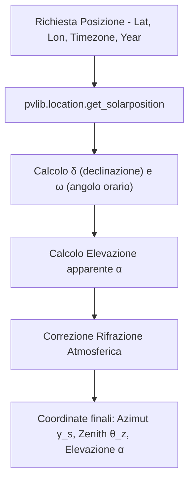
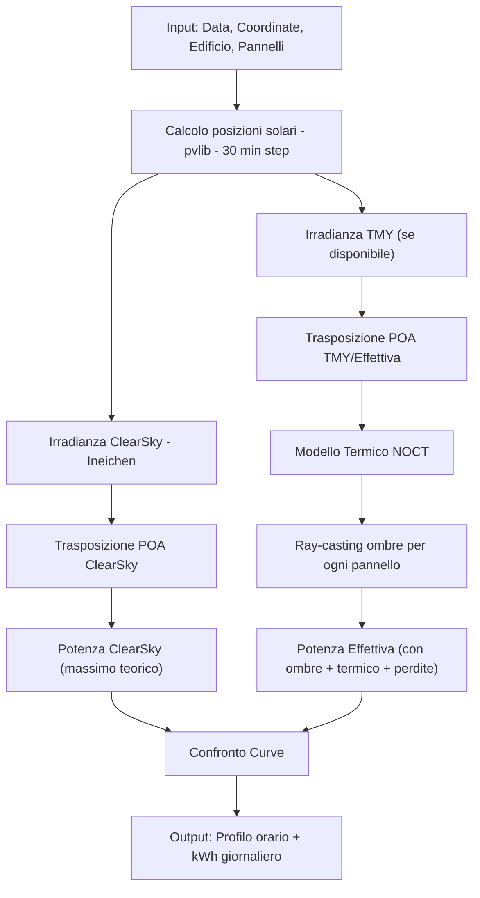
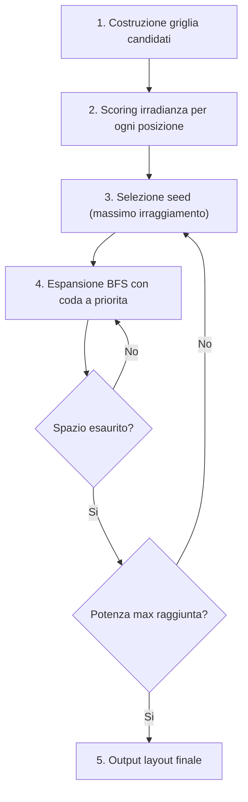

# Modelli Fisici e Matematici (SolarOptimizer3D)

Questo documento descrive in dettaglio i modelli fisici e matematici implementati in SolarOptimizer3D per il calcolo della posizione solare, dell'irradianza, dell'ombreggiamento, del modello termico, dell'ottimizzazione del posizionamento, del dimensionamento stringhe e dell'analisi economica.

---

## 1. Posizione Solare

Il sistema utilizza la libreria `pvlib` per calcolare con precisione astronometrica la posizione del sole.

### Coordinate Orizzontali

Per ogni ora dell'anno, la posizione apparente del sole viene calcolata in base a:

- **Latitudine ($\phi$)** e **Longitudine ($\lambda$)** del sito.
- **Formato Temporale ($t$)** convertito in tempo solare vero.

Le equazioni principali (dietro le quinte di `pvlib`) derivano gli angoli:

- **Declinazione solare ($\delta$):** Angolo tra i raggi solari e il piano equatoriale.
- **Angolo orario ($\omega$):** Misura la deviazione del sole dal meridiano locale.

I risultati output per il frontend e la simulazione sono:

- **Elevazione apparente ($\alpha$):** Angolo sopra l'orizzonte (corretto per la rifrazione atmosferica).
- **Zenith apparente ($\theta_z$):** $\theta_z = 90^\circ - \alpha$.
- **Azimut ($\gamma_s$):** Orientamento orizzontale misurato da Nord ($0^\circ$) in senso orario fino a $360^\circ$ (convenzione pvlib).

Dalla generazione temporale (step `1h` su un anno intero), vengono escluse le ore notturne filtrando per $\alpha > 0$.

---

## 2. Irradianza

Il calcolo dell'irradianza determina l'energia incidente su un pannello inclinato (Plane of Array, POA).

### 2.1 Dati Meteorologici (TMY)

Il sistema tenta prima di scaricare dati **TMY (Typical Meteorological Year)** dall'API PVGIS per la località selezionata. I dati TMY includono:

- **GHI** (Global Horizontal Irradiance)
- **DNI** (Direct Normal Irradiance)
- **DHI** (Diffuse Horizontal Irradiance)
- **Temperatura ambiente** e **velocita del vento**

I dati vengono memorizzati in **cache in memoria** (coordinate arrotondate a 1 decimale) per ridurre le chiamate API.

Se i dati TMY non sono disponibili, il sistema effettua un **fallback al modello ClearSky**.

### 2.2 Modello ClearSky

Viene utilizzato il modello di cieli sereni di *Ineichen & Perez* (via `pvlib`) per stimare l'irradianza orizzontale teorica massima. Vengono prodotte tre grandezze:

- **GHI (Global Horizontal Irradiance):** Irradianza globale su piano orizzontale.
- **DNI (Direct Normal Irradiance):** Irradianza diretta normale ai raggi del sole.
- **DHI (Diffuse Horizontal Irradiance):** Irradianza diffusa dal cielo.

La scomposizione di base e:
$$ GHI = DNI \cdot \cos(\theta_z) + DHI $$

### 2.3 Trasposizione su Piano Inclinato (POA)

Le coordinate del pannello sono definite da:

- **Inclinazione (Tilt, $\beta$):** Angolo del pannello rispetto all'orizzontale.
- **Azimut (Surface Azimuth, $\gamma_p$):** Orientamento del pannello.

Il sistema utilizza il **Modello di Perez** (via `pvlib.irradiance.get_total_irradiance`) per la trasposizione su piano inclinato. L'irradianza globale POA ($E_{poa}$) e calcolata come:
$$ E_{poa} = E_{b,poa} + E_{d,poa} + E_{r,poa} $$

Dove:

- **Diretta ($E_{b,poa}$):** $DNI \cdot \cos(\theta_{inc})$, dove $\theta_{inc}$ e l'angolo di incidenza sul pannello.
- **Diffusa dal cielo ($E_{d,poa}$):** Calcolata con il modello anisotropico di Perez, che considera la distribuzione non uniforme della radiazione diffusa (circumsolare + orizzonte + isotropica).
- **Riflessa da terra ($E_{r,poa}$):** $GHI \cdot \rho \cdot \left( \frac{1 - \cos(\beta)}{2} \right)$, con albedo $\rho \approx 0.2$.

I risultati vengono aggregati in **totali mensili** e **totale annuale** espressi in $\text{kWh/m}^2$.

---

## 3. Ombreggiamento (Ray-casting)

Il motore delle ombre calcola una heatmap di ombreggiamento sul tetto dell'edificio mediante algoritmi fisici basati su Python e `trimesh`.

### 3.1 Vettori Solari

Il sole viene modellato come una serie di vettori direttori $\hat{s}$ verso la sua posizione apparente, calcolati nel sistema di coordinate Y-up (Three.js standard):
$$ \hat{s}_x = \cos(\alpha) \cdot \sin(\gamma_s) $$
$$ \hat{s}_y = \sin(\alpha) $$
$$ \hat{s}_z = -\cos(\alpha) \cdot \cos(\gamma_s) $$

Dove $-Z$ = Nord ($\gamma_s = 0°$) e $+X$ = Est ($\gamma_s = 90°$).

#### Modalita di Campionamento

I vettori solari vengono generati in base alla modalita di analisi:

| Modalita | Campionamento | Vettori (~) |
|----------|---------------|-------------|
| **Annuale** | 12 giorni rappresentativi (15 di ogni mese), ore 8-18 | ~132 |
| **Mensile** | Tutti i giorni del mese selezionato, ore 8-18 | ~300 |
| **Istantanea** | Singolo timestamp | 1 |

### 3.2 Rotazione dei Vettori Solari

Per supportare edifici con orientamento arbitrario e multi-zona di installazione, i vettori solari vengono **ruotati nel sistema di riferimento locale dell'edificio**:

$$ \theta_{rot} = -(\gamma_{azimut} + \theta_{modello}) \cdot \frac{\pi}{180} $$

La matrice di rotazione $R_y(\theta_{rot})$ viene applicata a tutti i vettori solari:
$$ \hat{s}' = R_y(\theta_{rot}) \cdot \hat{s} $$

Questo garantisce che il ray-casting avvenga nel frame locale dell'edificio, indipendentemente dall'orientamento dell'immobile.

### 3.3 Griglia Tetto e Generazione Punti

Sulla superficie del tetto viene proiettata una griglia $N \times N$ (configurabile: 30, 50 o 100 punti per lato). Per ogni punto della griglia:

1. Un raggio viene lanciato dall'alto verso il basso per intersecare la superficie del tetto.
2. Vengono filtrati solo i punti su superfici con normali rivolte verso l'alto ($n_y > 0.1$), escludendo pareti laterali.
3. Se sono definiti **poligoni di installazione**, il dominio viene ristretto con un margine di 0.5m.

### 3.4 Legge del Coseno di Lambert

Invece di contare in modo binario le ombre, il motore integra una vera quantificazione energetica. Il $\cos(\theta)$ e calcolato come prodotto scalare tra la normale della superficie ($\hat{n}$) e il vettore solare ($\hat{s}$):
$$ \cos(\theta) = \hat{n} \cdot \hat{s} $$

Il sole colpisce la superficie solo per orientamenti a vista frontale ($\cos(\theta) > 0$).

### 3.5 Ray-casting a Due Passaggi

Il ray-casting utilizza un approccio a **due passaggi** per gestire correttamente materiali con diversa trasmissivita:

**Passaggio 1 — Geometria opaca:**
- Edificio, tronchi degli alberi, ostacoli rigidi (camini, antenne, box)
- Se il raggio interseca qualsiasi geometria opaca → punto completamente ombreggiato ($\text{attenuation} = 0$)

**Passaggio 2 — Chiome degli alberi:**
- Le chiome (coni, sfere, ombrelli, colonnari) hanno **trasmissivita stagionale** variabile mese per mese
- Per ogni raggio che attraversa una chioma: $\text{attenuation} \times= \tau_{mese}$
- Se il raggio attraversa piu chiome, le attenuazioni si **moltiplicano** (stacking)

La trasmissivita mensile predefinita per alberi decidui e:

| Gen | Feb | Mar | Apr | Mag | Giu | Lug | Ago | Set | Ott | Nov | Dic |
|-----|-----|-----|-----|-----|-----|-----|-----|-----|-----|-----|-----|
| 0.80 | 0.80 | 0.65 | 0.40 | 0.15 | 0.10 | 0.10 | 0.10 | 0.15 | 0.40 | 0.70 | 0.80 |

Per alberi sempreverdi: $\tau \approx 0.15\text{-}0.18$ costante tutto l'anno.

### 3.6 Ray-casting Batch Vettorizzato

Il motore utilizza un approccio **batch vettorizzato** con NumPy per prestazioni ottimali:

1. **Filtro facce per quota:** Prima del ray-casting, vengono escluse le facce della mesh al di sotto del piano di installazione, riducendo la geometria da testare.
2. **Chunked processing:** I raggi vengono processati in blocchi (chunk) per controllare l'uso della memoria.
3. **BVH mesh caching:** La struttura BVH (Bounding Volume Hierarchy) della mesh viene memorizzata in cache per evitare ricostruzioni ripetute.
4. **Mesh decimation:** Mesh complesse vengono decimate (3000 → 1500 facce) per accelerare il ray-casting senza perdita significativa di precisione.
5. **Filtraggio spaziale ostacoli:** Gli ostacoli vengono filtrati per distanza e direzione rispetto al vettore solare corrente (`filter_obstacles_by_sun`).

### 3.7 Frazione Diretta e Irradianza

L'irradianza diretta normalizzata accumula il contributo di tutti i raggi solari:

$$ F_{dir} = \frac{\sum_{i \in \text{visibili}} \cos(\theta_i) \cdot \text{attenuation}_i}{\sum_{j=1}^{N} \max(\hat{s}_{j,y}, 0)} $$

Il denominatore e il riferimento per una superficie orizzontale senza ostruzioni.

### 3.8 Sky View Factor (SVF)

Il calcolo valuta la componente radiativa diffusa. Lo Sky View Factor quantifica quanta porzione del cielo (emisfero) e visibile dal punto.

**Campionamento emisferico stratificato:**
- 24 direzioni azimutali uniformemente distribuite
- 4 livelli di elevazione: 15°, 35°, 55°, 75°
- Pesi basati sull'angolo solido: $w = \cos(\alpha_{el}) \cdot \sin(\alpha_{el})$

$$ \text{SVF} = \frac{\sum_{\text{raggi cielo non bloccati}} w_i}{\sum_{\text{raggi totali}} w_i} $$

Punti lungo il colmo del tetto vedranno l'intero cielo (SVF $\approx$ 1.0), punti vicino alle ostruzioni avranno visione ridotta.

### 3.9 Modello di Composizione Ombra Finale

L'irradianza normalizzata per ogni punto e una combinazione ponderata delle due componenti:
$$ I_{norm} = 0.65 \cdot F_{dir} + 0.35 \cdot \text{SVF} $$

Il peso 65/35 rappresenta un rapporto tipico diretto/diffuso per clima mediterraneo.

Il valore di "ombra" (`shadow_fraction`) e poi ricavato come:
$$ \text{shadow\_fraction} = 1.0 - I_{norm} $$

Per la visualizzazione: 0.0 = libero/verde, 1.0 = ombreggiato/viola scuro.

I punti fuori dai poligoni di installazione vengono marcati con valore sentinella $-1.0$.

---

## 4. Modello Termico (NOCT)

Il sistema implementa il de-rating della potenza basato sulla temperatura della cella, utilizzato nella simulazione giornaliera.

### 4.1 Temperatura della Cella

La temperatura della cella fotovoltaica viene stimata con il modello NOCT (Nominal Operating Cell Temperature):

$$ T_{cella} = T_{amb} + \frac{NOCT - 20}{800} \cdot E_{poa} $$

Dove:
- $T_{amb}$: Temperatura ambiente (da TMY o valore di default)
- $NOCT$: Temperatura nominale di funzionamento della cella (tipicamente 45°C)
- $E_{poa}$: Irradianza sul piano del pannello (W/m²)

**Condizioni di riferimento:**
- **STC (Standard Test Conditions):** $E = 1000$ W/m², $T_{cella} = 25°C$, AM 1.5
- **NOCT:** $E = 800$ W/m², $T_{amb} = 20°C$, vento 1 m/s

### 4.2 De-rating Termico

La potenza effettiva rispetto alle condizioni STC (Standard Test Conditions, 25°C) viene calcolata come:

$$ P_{ratio} = 1 + \gamma_{temp} \cdot (T_{cella} - 25) $$

Dove $\gamma_{temp}$ e il coefficiente di temperatura del pannello (tipicamente $-0.003$ a $-0.005$ °C⁻¹, cioe -0.3% / -0.5% per °C).

Il rapporto viene **clampato** nell'intervallo $[0.5, 1.0]$ per evitare valori estremi non fisici.

### 4.3 Potenza Effettiva

La potenza istantanea per ogni pannello viene calcolata come:

$$ P_{effettiva} = P_{STC} \cdot P_{ratio} \cdot f_{ombra} \cdot (1 - \text{perdite\_sistema}) $$

Dove:
- $P_{STC}$: Potenza nominale alle condizioni STC (W)
- $f_{ombra}$: Fattore di ombreggiamento per il pannello (0.0 = completamente ombreggiato, 1.0 = libero)
- $\text{perdite\_sistema}$: Perdite BOS (Balance of System) — inverter, cablaggio, soiling, mismatch

---

## 5. Simulazione Giornaliera

La simulazione giornaliera calcola la produzione energetica ora per ora per un giorno specifico con step di 30 minuti.

### 5.1 Pipeline di Calcolo

### 5.2 Ombreggiamento dei Pannelli

Per la simulazione giornaliera, il ray-casting viene effettuato **per ogni singolo pannello** ad ogni timestep:

1. Si crea la scena 3D (edificio + ostacoli) separando geometria opaca e chiome
2. Per ogni pannello, il centro viene utilizzato come punto di origine del raggio
3. Si applica un offset di +0.3m lungo Y per evitare auto-intersezione
4. Il raggio punta verso la posizione solare (rotata nel frame locale dell'edificio)
5. **Passaggio opaco**: Se il raggio interseca geometria opaca → pannello completamente ombreggiato
6. **Passaggio chioma**: Se il raggio attraversa chiome → attenuazione con trasmissivita mensile

### 5.3 Output

Per ogni timestep di 30 minuti vengono forniti:

- **Potenza ClearSky** ($P_{cs}$): Massima potenza teorica senza nuvole ne ombre
- **Potenza Ideale** ($P_{ideale}$): Potenza con dati meteo TMY ma senza ombre
- **Potenza Effettiva** ($P_{eff}$): Potenza con ombre + de-rating termico + perdite di sistema
- **Perdite per ombreggiamento** (%): $\frac{P_{ideale} - P_{eff}}{P_{ideale}} \cdot 100$
- **Perdite per temperatura** (%): $(1 - P_{ratio}) \cdot 100$

La produzione giornaliera totale si ottiene integrando le potenze nel tempo:
$$ E_{giorno} = \sum_{t} P_{eff}(t) \cdot \Delta t $$

---

## 6. Ottimizzazione Seed-and-Grow

L'algoritmo **Seed-and-Grow** e un approccio euristico greedy spaziale per il posizionamento ottimale dei pannelli solari sul tetto.

### 6.1 Panoramica dell'Algoritmo

A differenza degli algoritmi genetici, il Seed-and-Grow opera con un'espansione deterministica a macchia d'olio, partendo dai punti con massimo irraggiamento e crescendo verso i vicini.

### 6.2 Costruzione della Griglia Candidati

Per ogni possibile posizione del pannello nella griglia, si verifica:

1. **Tutti e 4 gli angoli** del pannello sono dentro i confini del tetto (con `roof_margin`)
2. **Nessuna sovrapposizione** con ostacoli proiettati in 2D (bounding box AABB)
3. **Contenimento nel poligono** di installazione (se definito), verificato con ray-casting per tutti i 4 angoli

### 6.3 Scoring e Soglia

Ogni candidato riceve un punteggio di irradianza basato sulla media delle celle della heatmap coperte dal pannello. Le celle con valore sentinella ($-1.0$, fuori dal poligono) vengono escluse dal calcolo.

### 6.4 Espansione Multi-Seed

L'algoritmo procede per **fasi di seed**:

1. **Seed:** Seleziona il candidato disponibile con il massimo irraggiamento
2. **Grow:** Espande il layout usando una **coda a priorita** (max-heap) basata sull'irradianza dei vicini
3. **Vicini Von Neumann:** Solo le 4 direzioni cardinali (N/S/E/W), non diagonali:
   - $(\pm e_{pw}, 0)$ — spostamento orizzontale di una larghezza effettiva del pannello
   - $(0, \pm e_{ph})$ — spostamento verticale di una altezza effettiva del pannello
4. **Soglia di taglio:** I vicini con irradianza $< 0.3 \times$ irradianza del seed vengono scartati
5. Se lo spazio libero si esaurisce, l'algoritmo apre un **nuovo seed** e riprende l'espansione

L'espansione continua fino al raggiungimento del limite `max_peak_power` (kWp).

### 6.5 Selezione Automatica dell'Orientamento

L'algoritmo viene eseguito **due volte** con orientamento forzato:
- **Portrait:** Pannello verticale ($w \times h$)
- **Landscape:** Pannello orizzontale ($h \times w$)

Viene selezionato l'orientamento con il miglior **rendimento specifico** (kWh/kWp):
$$ \text{Specific Yield} = \frac{E_{totale}}{P_{totale,kW}} $$

### 6.6 Vincoli

| Vincolo | Descrizione |
|---------|-------------|
| `max_peak_power` | Potenza massima installabile (kWp) |
| `min_distance` | Distanza minima tra pannelli (m) |
| `roof_margin` | Margine dal bordo del tetto (m) |
| `allow_rotation` | Permetti orientamento landscape |
| `require_strings` | Penalizza layout disconnessi |
| `installation_polygons` | Zone di installazione consentite |

### 6.7 Calcolo Energia

Per ogni pannello piazzato:

$$ E_{pannello} = E_{annuale,poa} \cdot A_{pannello} \cdot \eta_{eff} \cdot (1 - \text{ombra\_media}) $$

Dove:
- $E_{annuale,poa}$: Irradianza annuale sul piano inclinato (kWh/m²)
- $A_{pannello}$: Area del pannello (m²)
- $\eta_{eff}$: Efficienza del pannello
- $\text{ombra\_media}$: Media della shadow fraction sulle celle coperte

---

## 7. Dimensionamento Stringhe

Il servizio di stringing calcola la configurazione serie/parallelo ottimale dei pannelli per il collegamento all'inverter, secondo la normativa IEC 62548.

### 7.1 Correzione per Temperatura

I parametri elettrici del pannello variano con la temperatura. Le correzioni vengono applicate usando il coefficiente di temperatura:

$$ V_{oc,max} = N_{serie} \cdot V_{oc,STC} \cdot \left[1 + \frac{\gamma_{Voc}}{100} \cdot (T_{min} - 25)\right] $$

$$ V_{mpp,min} = N_{serie} \cdot V_{mpp,STC} \cdot \left[1 + \frac{\gamma_{Voc}}{100} \cdot (T_{max} - 25)\right] $$

$$ V_{mpp,max} = N_{serie} \cdot V_{mpp,STC} \cdot \left[1 + \frac{\gamma_{Voc}}{100} \cdot (T_{min} - 25)\right] $$

$$ I_{sc,max} = N_{parallelo} \cdot I_{sc,STC} \cdot \left[1 + \frac{\gamma_{Isc}}{100} \cdot (T_{max} - 25)\right] $$

Dove:
- $T_{min}$: Temperatura minima storica del sito (°C)
- $T_{max}$: Temperatura massima storica del sito (°C)
- $\gamma_{Voc}$: Coefficiente di temperatura della Voc (%/°C, tipicamente $-0.27$)
- $\gamma_{Isc}$: Coefficiente di temperatura della Isc (%/°C, tipicamente $+0.05$)

### 7.2 Verifiche Elettriche

Per ogni configurazione serie/parallelo, vengono verificati i seguenti vincoli:

| Verifica | Condizione | Conseguenza |
|----------|------------|-------------|
| Tensione massima | $V_{oc,max}(T_{min}) \leq V_{max,inverter}$ | Protezione da sovratensione |
| Range MPPT minimo | $V_{mpp,min}(T_{max}) \geq V_{MPPT,min}$ | Garantisce tracking MPP |
| Range MPPT massimo | $V_{mpp,max}(T_{min}) \leq V_{MPPT,max}$ | Garantisce tracking MPP |
| Corrente per canale | $I_{sc,max}(T_{max}) \leq I_{max,canale}$ | Protezione da sovracorrente |
| Potenza DC totale | $P_{DC} \leq P_{DC,max,inverter}$ | Limite potenza ingresso |

### 7.3 Rapporto DC/AC

$$ \text{DC/AC ratio} = \frac{P_{DC,totale}}{P_{AC,nominale,inverter}} $$

- $\leq 1.3$: Ottimale
- $1.3 - 1.5$: Accettabile (warning)
- $> 1.5$: Sovradimensionamento eccessivo (errore)

### 7.4 Modalita Auto

La modalita automatica itera su tutte le combinazioni valide di $N_{serie}$, $N_{parallelo}$ e $N_{MPPT}$ per trovare la configurazione che **massimizza il numero di pannelli utilizzati**, rispettando tutti i vincoli elettrici dell'inverter.

### 7.5 Modalita Manuale

La modalita manuale accetta $N_{serie}$ e $N_{parallelo}$ dall'utente, calcola i parametri elettrici risultanti e verifica la compatibilita con l'inverter, restituendo warning ed errori specifici.

---

## 8. Analisi Economica

Il modello economico valuta il ritorno dell'investimento fotovoltaico calcolando autoconsumo, cessione in rete e payback period.

### 8.1 Profili di Consumo

Il sistema supporta 3 livelli di dettaglio per il profilo di consumo dell'utenza:

| Livello | Input | Precisione |
|---------|-------|------------|
| **Annuo** | Singolo valore kWh/anno | Distribuzione mensile ENEA |
| **Mensile** | 12 valori kWh/mese | Distribuzione oraria ENEA |
| **Orario** | 8760 valori kWh/ora | Massima precisione |

La distribuzione ENEA e un profilo residenziale italiano che modella i pattern di consumo tipici.

### 8.2 Calcolo Autoconsumo

Per ogni mese, il calcolo confronta la produzione oraria con il consumo orario:

$$ E_{autoconsumo,h} = \min(E_{produzione,h}, E_{consumo,h}) $$

$$ E_{cessione,h} = E_{produzione,h} - E_{autoconsumo,h} $$

$$ E_{rete,h} = E_{consumo,h} - E_{autoconsumo,h} $$

### 8.3 Indicatori Economici

**Tasso di autoconsumo:**
$$ \text{SCR} = \frac{\sum E_{autoconsumo}}{\sum E_{produzione}} \cdot 100 $$

**Tasso di autosufficienza:**
$$ \text{SSR} = \frac{\sum E_{autoconsumo}}{\sum E_{consumo}} \cdot 100 $$

**Risparmio annuo:**
$$ \text{Risparmio} = \sum E_{autoconsumo} \cdot \text{tariffa\_energia} $$

**Ricavo cessione:**
$$ \text{Ricavo} = \sum E_{cessione} \cdot \text{tariffa\_GSE} $$

### 8.4 Payback Period

$$ \text{Payback} = \frac{\text{Costo impianto}}{\text{Risparmio annuo} + \text{Ricavo annuo}} $$

Il payback viene calcolato solo se il costo dell'impianto e fornito come parametro.

---

## 9. Geometria dei Tetti

### 9.1 Tipi Supportati

#### Tetto Piano (`flat`)
Superficie orizzontale a quota $h_{edificio}$. I pannelli giacciono piatti con inclinazione $-90°$ attorno a X.

#### Tetto a Due Falde (`gable`)
Due superfici inclinate simmetriche con colmo lungo l'asse X. L'angolo di falda determina l'altezza del colmo:
$$ h_{colmo} = h_{edificio} + \frac{d}{2} \cdot \tan(\alpha_{tetto}) $$

Ogni pannello viene proiettato sulla falda appropriata (Nord o Sud) con inclinazione pari all'angolo del tetto.

#### Tetto a Padiglione (`hip`)
Quattro falde inclinate convergenti verso un colmo ridotto. Parametri aggiuntivi:
- `ridgeHeight`: Altezza del colmo rispetto al piano del tetto
- `ridgeLength`: Lunghezza del colmo (< larghezza edificio)

Il pannello viene assegnato alla falda corretta (Nord, Sud, Est, Ovest) tramite proiezione geometrica del suo centro.

### 9.2 Proiezione Pannello su Tetto Inclinato

Per tetti inclinati, l'altezza effettiva del pannello proiettata sulla falda si riduce:
$$ e_{ph,proj} = e_{ph} \cdot \cos(\alpha_{tetto}) $$

Dove $\alpha_{tetto}$ e l'angolo di inclinazione della falda. Questa proiezione e utilizzata dall'algoritmo di ottimizzazione per calcolare correttamente lo spazio occupato dai pannelli sulle falde.

La posizione Y e la rotazione del pannello vengono calcolate interpolando tra i bordi della falda:
1. Si determina la falda di appartenenza del pannello
2. Si interpola l'altezza Y in base alla distanza dal bordo
3. Si calcola la rotazione necessaria per allineare il pannello alla superficie inclinata

---

## 10. Sistemi di Coordinate

### 10.1 Tre Sistemi

| Sistema | Asse Su | Asse Nord | Utilizzo |
|---------|---------|-----------|----------|
| **Three.js (Frontend)** | +Y | -Z | Scena 3D, rendering |
| **pvlib (Solare)** | — | 0° azimut | Calcolo posizione solare |
| **trimesh (Mesh)** | +Z (input) → +Y (convertito) | — | Import mesh, ray-casting |

### 10.2 Conversione Coordinate Solari

Da coordinate sferiche pvlib (azimut $\gamma$, elevazione $\alpha$) a vettore cartesiano Three.js:
$$ x = \cos(\alpha) \cdot \sin(\gamma) \quad \text{(Est = positivo)} $$
$$ y = \sin(\alpha) \quad \text{(Alto = positivo)} $$
$$ z = -\cos(\alpha) \cdot \cos(\gamma) \quad \text{(Nord = negativo)} $$

### 10.3 Rotazione Edificio

La rotazione dell'edificio nel frontend viene calcolata come:
$$ \theta_{rot} = -(\gamma_{azimut} + \theta_{modello}) \cdot \frac{\pi}{180} $$

Il segno negativo e necessario affinche $R_y(\theta) \cdot [0, 0, -1]$ punti nella direzione dell'azimut. Il backend applica la stessa rotazione inversa ai vettori solari durante il ray-casting.

### 10.4 Conversione Mesh Import

I file OBJ/STL tipicamente usano il sistema Z-up. L'importazione applica:
1. Rotazione di $-90°$ attorno all'asse X ($Z\text{-up} \rightarrow Y\text{-up}$)
2. Traslazione al centro nel piano XZ
3. Allineamento del pavimento a $Y = 0$
